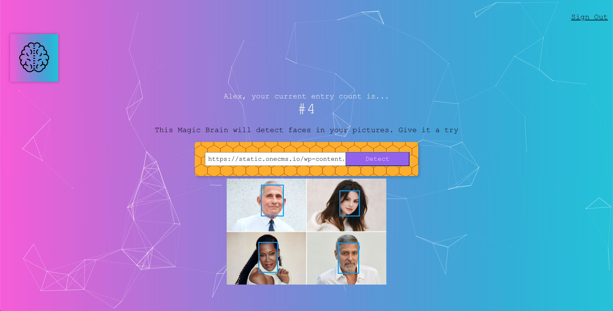

# Smart Brain

A fun React app that allows users to sign up and begin detecting faces in the images they provide. Smart Brain will track the number of entries from a user and store their credentials in a database. AI face detection is provided and processed by [Clarifai API](https://www.clarifai.com/models/ai-face-detection).

 

 

### This project uses the following front-end packages and libraries:

- [React.js](https://reactjs.org/) (UI library)
- [Redux](https://redux.js.org/) (state manager)
- [Redux-Saga](https://redux-saga.js.org/) (to handle asynchronous actions)
- [Reselect](https://github.com/reduxjs/reselect) (to create memoized state selectors)
- [React Router DOM](https://reactrouter.com/) (page router)
- [Particles.js](https://vincentgarreau.com/particles.js/) (for background animations)
- [Tachyons](https://tachyons.io/) (for CSS styles)

 

### This project uses the following back-end packages, libraries, and technologies:

- [Node.js](https://nodejs.org/en/) (JavaScript runtime)
- [Express](https://expressjs.com/) (web framework)
- [PostGreSQL](https://www.postgresql.org/) (database)
- [Knex.js](http://knexjs.org/) (SQL query builder)
- [Clarifai](https://www.clarifai.com/) (for AI face detection)
- [bcrypt](https://www.npmjs.com/package/bcrypt) (to hash passwords)
